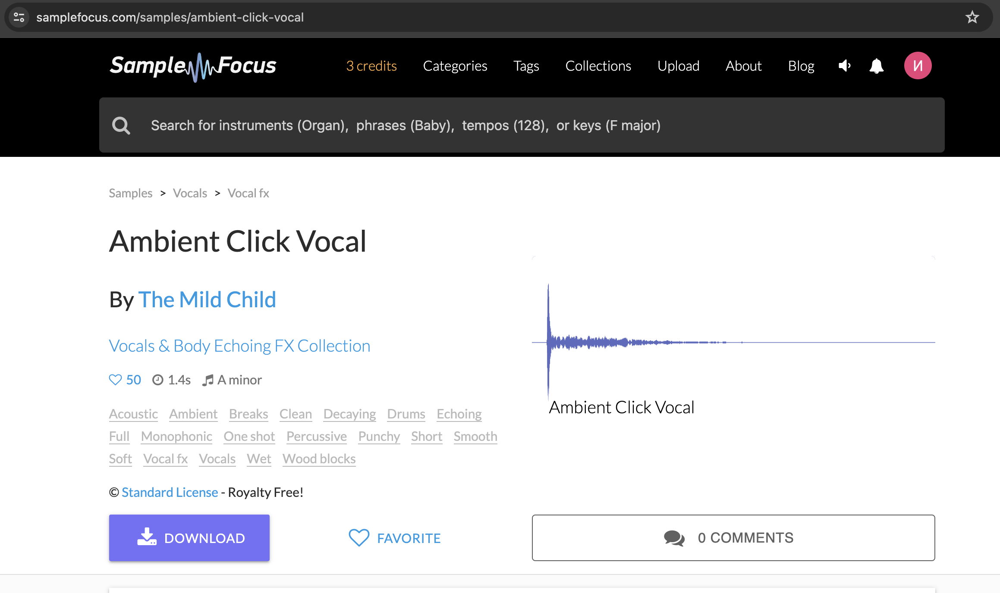
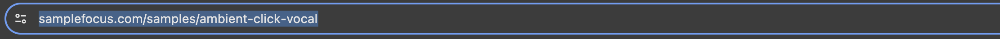
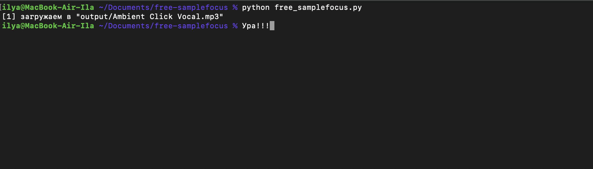

## Зачем платить за аудиофайлы?

Если вы пытались скачать семплы на популярном сайте samplefocus.com, то заметили, что дается лишь 3 попытки скачать файл, находящийся в открытом доступе. А чтобы скачать больше необходимо купить подписку!

Я думаю вы также считаете, что это несправедливо, поэтому этот скрипт позволит скачать необходимые вам аудиофайлы легко и в исходном качестве!

## Как использовать?

1. Зайдите на страницу нужного семпла

2. Скопируйте URL ссылку

3. Добавьте в список ссылку

```py
# URL семплов для загрузки
SAMPLE_URLS = [
    'https://samplefocus.com/samples/ambient-click-vocal'
]
```

4. Запустите скрипт


Готово! Прекрасно, когда музыканту не приходится платить за подписку, чтобы создавать музыку.

